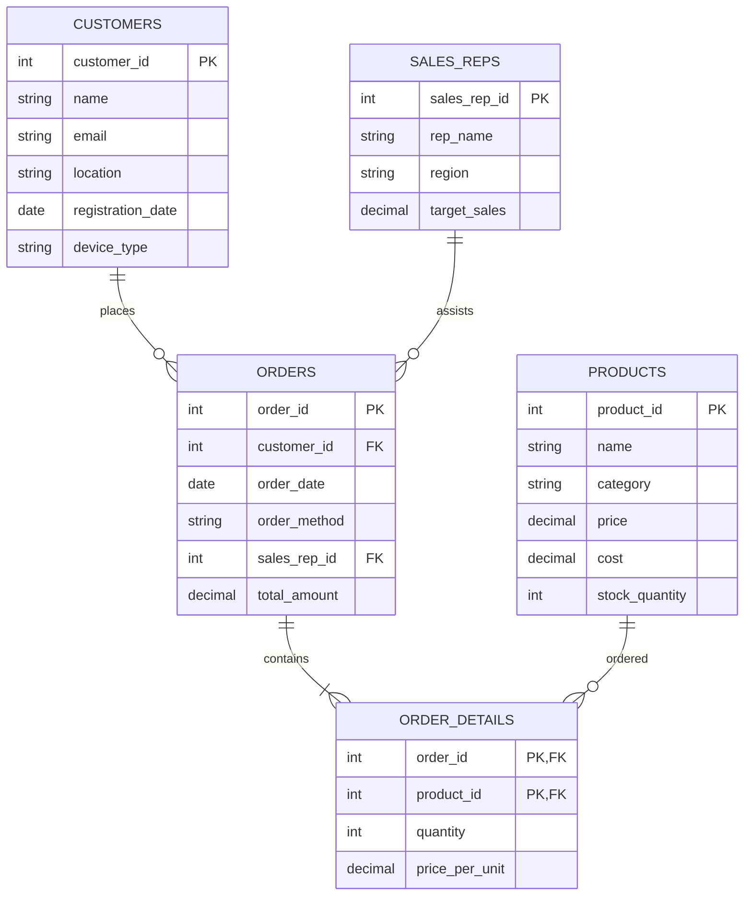

# 📱 Omnichannel Retail Analytics & SQL Case Study Dashboard
> **Bangalore Mobile Accessories Co. — 2023 Global Transactions Analysis**

[](#)
[](#)
[](#)
[](#)
[](#)
[](#)

This is a premium, high-fidelity interactive **Omnichannel Retail Analytics SQL Dashboard** built to solve and visualize the **Coding Ninjas E-Commerce Company Case Study** capstone project. It showcases advanced relational database design (DDL), sample data population (DML), and 8 high-level SQL business analytics queries.

---

## 🌟 Interactive Live Demo Preview

The project is packaged as a pure frontend single-page application (SPA) featuring:
- **Interactive SQL Console:** Choose a business problem, view the highlighted SQL syntax, and click "Execute" to witness real-time SQLite-emulated query processing.
- **Dynamic Charts:** Renders beautiful polar area, doughnut, bar, and line metrics using **Chart.js** tailored to your active query outputs.
- **One-Click Script Compilation:** Downloads a fully annotated, formatted `.sql` execution script containing all database definitions and solutions.

---

## 📐 Relational Database Schema (ERD)

Below is the database architecture modeling the 14-country omnichannel transaction operations:



---

## 🧠 Case Study Queries & Solved Problems

### 📁 Solved SQL Files Folder
- **[DDL Database Schema Design](file:///c:/Users/theab/OneDrive/Desktop/ninja/sql/schema.sql)**: Optimized database definition scripts.
- **[DML & Solved Query Scripts](file:///c:/Users/theab/OneDrive/Desktop/ninja/sql/queries.sql)**: Fully commented query answers.

### ❓ Key Problems Covered:

1. **Global Sales Revenue & AOV by Country:** Ranks geographic markets by total sales value and calculates their Average Order Value (AOV).
2. **Channel Performance (App, Web, WhatsApp, Helpline):** Breaks down transaction volumes and sales shares across ordering methods.
3. **RFM Customer Segmentation:** Leverages transaction frequencies and monetary spending to label buyers as *VIP*, *Active Regular*, *New*, or *Churn Risk*.
4. **Top 5 Most Profitable Accessories:** Evaluates volume sold against gross profit margins (Price - Cost) to optimize supply chains.
5. **Sales Reps Leaderboard vs Quotas:** Benchmarks domestic and international rep conversions against quarterly targets.
6. **Month-on-Month Sales Growth Trends:** Uses `LAG()` window functions to calculate growth patterns across seasons.
7. **First-Time vs Repeat Buyer Journeys:** Categorizes checkouts by channel based on user transaction sequences.
8. **Underperforming Country Markets:** Isolates country zones generating revenues below the global median for targeted expansion.

---

## ⚡ Direct Deployment to GitHub Pages

Since this dashboard is written in raw HTML, CSS, and JS, **you can host a live interactive demo on GitHub for free** in seconds!

1. Create a new repository on your GitHub account and push this directory:
   ```bash
   git init
   git add .
   git commit -m "feat: initial commit of interactive retail analytics dashboard"
   git remote add origin YOUR_REPOSITORY_URL
   git branch -M main
   git push -u origin main
   ```
2. Navigate to your repository's settings page: **Settings** -> **Pages**.
3. Under **Build and deployment**, set the source to **Deploy from a branch**.
4. Choose the **`main`** branch and click **Save**.
5. Your interactive portfolio project will be live at `https://YOUR_GITHUB_USERNAME.github.io/YOUR_REPO_NAME/` in under a minute!

---

## 📄 License
This project is open-source and licensed under the [MIT License](LICENSE).
